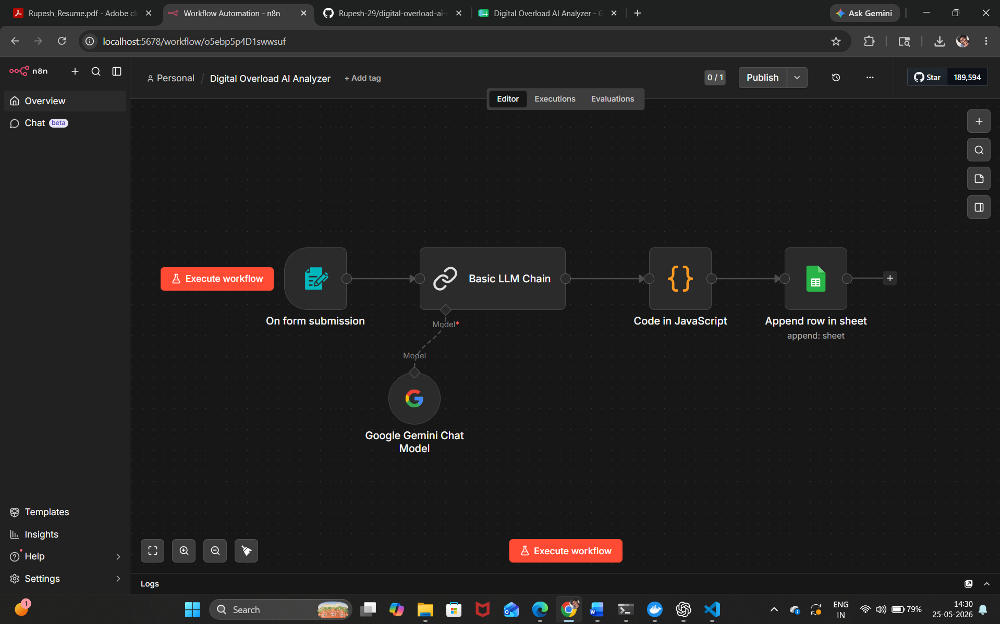
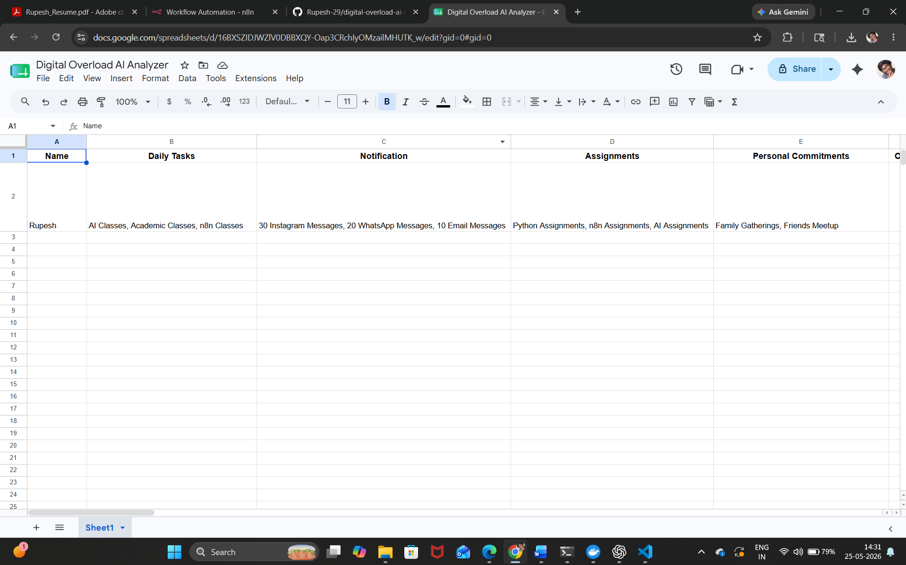

# Digital Overload AI – Intelligent Attention & Task Overload Analyzer

## Overview

Digital Overload AI is an AI-powered productivity analysis system built using n8n and Google Gemini AI. The project helps students and early-stage learners identify overload patterns, excessive context switching, unrealistic planning, and digital distractions from their daily tasks and commitments.

The system analyzes user inputs and provides intelligent prioritization, burnout detection, focus improvement suggestions, and structured scheduling recommendations.

---

## Problem Statement

Students often feel constantly busy due to notifications, assignments, academic pressure, social commitments, and multitasking. However, despite staying active throughout the day, many struggle to make meaningful progress because of fragmented attention and overload.

This project aims to solve that problem using AI-powered workflow automation.

---

## Features

* AI-powered overload analysis
* Burnout risk detection
* Priority task classification
* Distraction identification
* Suggested daily schedule
* Productivity improvement tips
* Confidence scoring
* Google Sheets report storage
* Fully automated workflow using n8n

---

## Technologies Used

* n8n
* Google Gemini AI
* Google Sheets
* JavaScript

---

## Workflow Architecture

Form Input → Gemini AI Analysis → Code Processing → Google Sheets Storage

---

## Example Outputs

* Overload Score
* Burnout Risk
* Main Problem
* Priority Tasks
* Tasks That Can Be Delayed
* Suggested Schedule
* Focus Improvement Tip

---

## Future Improvements

* Weekly overload reports
* Productivity dashboard
* Telegram/Gmail notifications
* Focus trend analytics
* Burnout prediction graphs

---

## Author

Rupesh Nagireddy

## Workflow Screenshot

---

## Google Sheets Output

